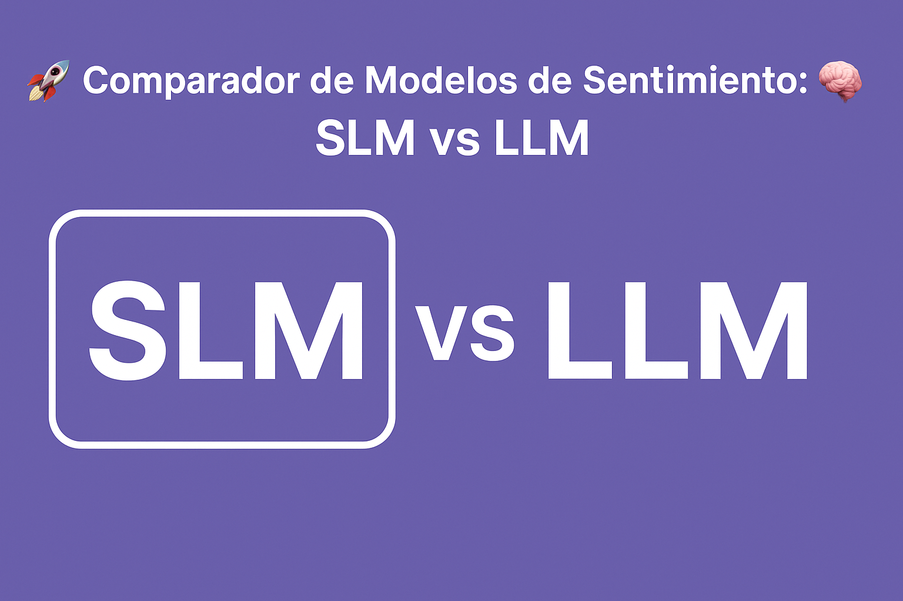

# 🚀 Comparador de Modelos de Sentimiento: SLM vs LLM 🧠

🌟 Descripción del Proyecto

Este proyecto es una aplicación interactiva construida con Streamlit que permite comparar el rendimiento y las características
de un Modelo de Lenguaje Pequeño (SLM - Small Language Model) entrenado localmente contra un Modelo de Lenguaje Grande (LLM -
Large Language Model) accesible a través de la API de inferencia de Hugging Face.

El objetivo principal es demostrar que, para tareas específicas y bien definidas como el análisis de sentimiento, los SLM
pueden ofrecer un rendimiento comparable al de los LLM, pero con ventajas significativas en términos de:

  * ⚡ Agilidad y Velocidad: Los SLM son más rápidos en inferencia.
  * 💰 Eficiencia de Costos: Requieren menos recursos computacionales, lo que se traduce en menores costos de operación.
  * ♻️ Consumo de Recursos: Utilizan menos memoria y CPU/GPU, siendo ideales para despliegues en entornos con recursos limitados o
    en el "edge".
  * 🎯 Especialización (Microservicios de IA): Al igual que los microservicios en el desarrollo de software, los SLM pueden ser
    entrenados y optimizados para una tarea muy concreta, haciéndolos extremadamente eficientes y precisos en su dominio, sin la
    sobrecarga de un modelo de propósito general.

En resumen, este proyecto busca ilustrar por qué, en muchos escenarios del mundo real, un SLM especializado puede ser una
solución más práctica, económica y eficiente que un LLM masivo.

✨ Características Destacadas

  * Comparación en Tiempo Real: Analiza el sentimiento de reseñas de películas simultáneamente con ambos tipos de modelos.
  * SLM Local: Utiliza un modelo DistilBERT fine-tuned para análisis de sentimiento, cargado y ejecutado directamente en tu
    máquina.
  * LLM Remoto (Hugging Face API): Permite seleccionar y probar diferentes LLM de instrucción disponibles a través de la API de
    inferencia gratuita de Hugging Face.
  * Gestión de Archivos Grandes: Implementa Git LFS para manejar eficientemente el modelo SLM de gran tamaño, manteniendo el
    repositorio ligero.
  * Interfaz Intuitiva: Desarrollado con Streamlit para una experiencia de usuario sencilla y visual.

🛠️ Tecnologías Utilizadas

  * Python 3.8+
  * Streamlit: Para la interfaz de usuario interactiva.
  * Hugging Face Transformers: Para la carga y uso del SLM.
  * Hugging Face Inference API: Para la interacción con los LLM remotos.
  * Git LFS (Large File Storage): Para la gestión de archivos grandes.
  * `python-dotenv`: Para la gestión segura de variables de entorno (tokens).
  * `requests`: Para realizar peticiones HTTP a la API de Hugging Face.

---

🚀 Guía de Usuario: ¡Manos a la Obra!

Esta sección es CRÍTICA para que puedas poner en marcha el proyecto sin problemas. Sigue los pasos cuidadosamente.

1. 📦 Pre-requisitos Esenciales

Antes de clonar el repositorio, asegúrate de tener instaladas las siguientes herramientas:

  * Git: El sistema de control de versiones.
  * Python 3.8 o superior: El lenguaje de programación.
  * Git LFS (Large File Storage): ¡MUY IMPORTANTE! Esta herramienta es fundamental para manejar el modelo SLM de 260MB. Si no la
    tienes instalada antes de clonar, Git descargará archivos "puntero" en lugar del modelo real, y la aplicación no funcionará.

1.1. ✅ Verificar Instalación de Git LFS

Abre tu terminal (o Git Bash en Windows) y ejecuta:

    git-lfs --version

Si ves un número de versión (ej. git-lfs/3.4.1), ¡excelente! Ya lo tienes. Si no, sigue las instrucciones de instalación a
continuación.

1.2. ⬇️ Instalación de Git LFS (Global)

🌐 Para Linux (Ubuntu/Debian):

    # Actualiza la lista de paquetes
    sudo apt-get update
    # Instala Git LFS
    sudo apt-get install git-lfs

🍎 Para macOS (usando Homebrew):

    # Instala Homebrew si no lo tienes: /bin/bash -c "$(curl -fsSL
    # https://raw.githubusercontent.com/Homebrew/install/HEAD/install.sh)"
    brew install git-lfs

🪟 Para Windows (usando Git Bash):

La forma más sencilla es descargar e instalar el instalador de Git for Windows.

  1. Descarga el instalador desde: https://git-scm.com/download/win (https://git-scm.com/download/win)
  2. Ejecuta el instalador.
  3. Durante el proceso de instalación, en la pantalla "Select Components", asegúrate de que la casilla "Git LFS (Large File
     Support)" esté marcada. Suele estarlo por defecto.
  4. Completa la instalación con las opciones predeterminadas.

1.3. 🗑️ Desinstalación de Git LFS (Global)

Si en algún momento necesitas desinstalar Git LFS de tu sistema:

🌐 Para Linux (Ubuntu/Debian):

    sudo apt-get remove git-lfs

🍎 Para macOS (usando Homebrew):

    brew uninstall git-lfs

🪟 Para Windows:

Git LFS se desinstala como cualquier otro programa de Windows:
  1. Ve a "Panel de control" -> "Programas" -> "Programas y características".
  2. Busca "Git" o "Git LFS" en la lista, selecciónalo y haz clic en "Desinstalar".

---

2. ⬇️ Clonar el Repositorio

Una vez que Git LFS esté instalado globalmente en tu sistema, puedes clonar el repositorio.

    # Abre tu terminal y navega al directorio donde quieres guardar el proyecto
    cd /ruta/a/tu/directorio/de/proyectos

    # Clona el repositorio (asegúrate de usar la URL de TU fork)
    git clone git@github.com:tu_usuario/ai-small-language-model.git
    # O si usas HTTPS:
    # git clone https://github.com/tu_usuario/ai-small-language-model.git

    # Navega al directorio del proyecto
    cd ai-small-language-model

⚠️ Aviso Importante: ¿Qué pasa si cloné SIN Git LFS?

Si por alguna razón clonaste el repositorio antes de instalar Git LFS, el archivo
**fine_tuned_sentiment_model_full_data/model.safetensors** será un pequeño archivo de texto (un "puntero") en lugar del modelo
real.

Para solucionarlo, después de instalar Git LFS globalmente, navega a la raíz del proyecto y ejecuta:

    git lfs pull

Esto forzará a Git LFS a descargar los archivos grandes reales.

---

3. ⚙️ Configuración del Entorno

Ahora que tienes el código, configura el entorno de Python.

3.1. 🐍 Crear y Activar Entorno Virtual

Es una buena práctica usar entornos virtuales para aislar las dependencias del proyecto.

    # Crea un entorno virtual (solo la primera vez)
    python3 -m venv .venv

    # Activa el entorno virtual
    # En Linux/macOS:
    source .venv/bin/activate
    # En Windows (Git Bash):
    source .venv/Scripts/activate

3.2. 📦 Instalar Dependencias

Con el entorno virtual activado, instala todas las librerías necesarias:

    pip install -r requirements.txt

3.3. 🔑 Configuración del Token de Hugging Face (.env)

Para que la aplicación pueda comunicarse con los LLM de Hugging Face, necesitas un token de acceso.

  1. Obtén tu Token:
        * Ve a Hugging Face Settings (https://huggingface.co/settings/tokens).
        * Crea un nuevo token con rol "read" (lectura).
        * Copia el token.

  2. Crea el archivo `.env`:
        * En la raíz de tu proyecto (ai-small-language-model/), crea un archivo llamado .env.
        * Abre este archivo y añade la siguiente línea, reemplazando `hf_YOUR_REAL_TOKEN_HERE` con tu token real:

      HF_TOKEN="hf_YOUR_REAL_TOKEN_HERE"

        * ¡IMPORTANTE! El archivo .env está en el .gitignore para que nunca se suba a tu repositorio público. ¡Mantén tu token en
          secreto!

3.4. 🤝 Aceptar Términos de Modelos (¡Crucial para Llama 3!)

Si planeas usar el modelo meta-llama/Meta-Llama-3-8B-Instruct (o cualquier otro modelo "gated"), DEBES ir a la página del modelo
  en Hugging Face y aceptar sus términos y condiciones. Sin este paso, tu token no tendrá permiso para acceder a la API de
inferencia de ese modelo.

  * Página de Llama 3 8B Instruct: https://huggingface.co/meta-llama/Meta-Llama-3-8B-Instruct
    (https://huggingface.co/meta-llama/Meta-Llama-3-8B-Instruct)

---

4. 🚀 Inicializar Git LFS en el Repositorio

Aunque ya lo instalaste globalmente, necesitas asegurarte de que tu repositorio local esté configurado para usar LFS.

    # Asegúrate de estar en la raíz de tu proyecto (donde está .git)
    git lfs install

---

5. ➕ Seguimiento de Archivos Grandes con Git LFS

Si vas a realizar desarrollos en el proyecto o necesitas asegurar que Git LFS haga un seguimiento explícito del modelo principal, ejecuta el siguiente comando **después de clonar el repositorio e inicializar Git LFS**:

    git lfs track "fine_tuned_sentiment_model_full_data/model.safetensors"

Este comando le indica a Git LFS que debe gestionar el archivo `model.safetensors` de forma especial, almacenando solo un "puntero" en el repositorio de Git y el contenido real del archivo en el servidor de LFS. Esto es **esencial** para manejar archivos pesados como modelos de IA, ya que mantiene el repositorio de Git ligero y acelera las operaciones de clonado y descarga para otros desarrolladores.

Si realizas cambios en el modelo o añades nuevos archivos grandes que desees que LFS gestione, deberás ejecutar `git lfs track` para cada uno de ellos. Una vez que un archivo está siendo "trackeado", cualquier `git add` y `git commit` lo procesará correctamente a través de LFS. Este paso es necesario para que, al subir tus cambios a tu fork y luego hacer una pull request, el archivo pesado sea gestionado correctamente por LFS, permitiendo a otros clonar y acceder al modelo sin problemas.

---

6. ▶️ Ejecutar la Aplicación Streamlit

¡Todo listo! Ahora puedes iniciar la aplicación.

    # Asegúrate de que tu entorno virtual esté activado
    streamlit run app.py

Esto abrirá la aplicación en tu navegador web (normalmente en http://localhost:8501).

---

7. 🖥️ Uso de la Interfaz

Una vez que la aplicación esté abierta en tu navegador:

  1. Selector de LLM: En la parte superior, verás un desplegable donde puedes seleccionar el LLM de Hugging Face que deseas usar
     para la comparación.
  2. Área de Texto: Introduce la reseña de la película en inglés que deseas analizar.
  3. Botón "Analizar Sentimiento": Haz clic en este botón para que ambos modelos (tu SLM local y el LLM seleccionado en la nube)
     procesen la reseña.
  4. Resultados: Verás los resultados de ambos modelos, mostrando su predicción de sentimiento (POSITIVO/NEGATIVO) y, en el caso
     del SLM, la confianza.

---

📂 Estructura del Proyecto

    .
    ├── .streamlit/             # Configuración de Streamlit (ej. secrets.toml si se usara)
    ├── fine_tuned_sentiment_model_full_data/ # 🧠 Directorio del modelo SLM (gestionado por Git LFS)
    │   ├── config.json
    │   ├── model.safetensors       # Archivo de modelo grande
    │   ├── special_tokens_map.json
    │   ├── tokenizer_config.json
    │   ├── tokenizer.json
    │   └── vocab.txt
    ├── .env                    # 🔑 Archivo para variables de entorno (NO SUBIR A GIT)
    ├── .gitattributes          # 🔗 Configuración de Git LFS
    ├── .gitignore              # 🚫 Archivos y directorios ignorados por Git
    ├── app.py                  # 🚀 Aplicación principal de Streamlit
    ├── ejem.py                 # (Archivo de ejemplo, puedes eliminarlo si no lo usas)
    ├── README.md               # 📄 Este mismo archivo
    ├── requirements.txt        # 📋 Dependencias de Python
    ├── train_sentiment_colab_full_data.py # Script de entrenamiento (Colab)
    ├── train_sentiment_model.py  # Script de entrenamiento
    └── .venv/                  # 🐍 Entorno virtual de Python

---

⚠️ **Nota para Compañeros: Seguimiento de Archivos Grandes con Git LFS**

El seguimiento con Git LFS se aplica específicamente a los archivos grandes declarados en el `.gitattributes`. En este proyecto, el archivo principal que Git LFS gestiona es **`fine_tuned_sentiment_model_full_data/model.safetensors`**.

Aunque veas la carpeta `fine_tuned_sentiment_model_full_data/`, Git LFS no "sigue" la carpeta entera en el sentido tradicional. En su lugar, el `.gitattributes` especifica que el archivo `.safetensors` (o `model.safetensors` directamente) dentro de esa carpeta debe ser tratado por LFS. Esto significa que cuando tú (o tus compañeros) clonáis o hacéis un `git pull`, si Git LFS está correctamente configurado e inicializado (`git lfs install`), los archivos grandes se descargarán automáticamente. No es necesario realizar un seguimiento manual de la carpeta completa, solo asegurarse de que el archivo del modelo esté configurado para LFS, lo cual ya está hecho en el repositorio. Si por alguna razón los archivos no se descargan correctamente (como se explica en la sección "Aviso Importante: ¿Qué pasa si cloné SIN Git LFS?"), el comando `git lfs pull` resolverá el problema, trayendo específicamente los contenidos de los archivos grandes que LFS gestiona.

---

🤝 Contribución

¡Las contribuciones son bienvenidas! Si deseas mejorar este proyecto, por favor:

  1. Haz un fork del repositorio.
  2. Crea una nueva rama (git checkout -b feature/nueva-funcionalidad).
  3. Realiza tus cambios y commitea (git commit -m 'feat: Añade nueva funcionalidad').
  4. Sube tu rama (git push origin feature/nueva-funcionalidad).
  5. Abre un Pull Request.

---

📄 Licencia

Este proyecto está bajo la Licencia MIT. Consulta el archivo LICENSE para más detalles.

---

📧 Contacto

¿Preguntas o sugerencias? No dudes en contactarme:

  * Nombre: Juan domingo
  * GitHub: (https://github.com/jdomdev)
